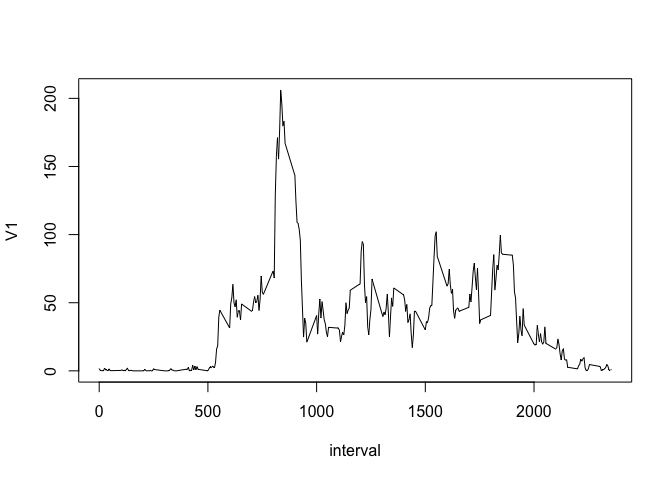

# Reproducible Research: Peer Assessment 1


## Loading and preprocessing the data

```r
library(data.table)
DT <- data.table(read.csv(unzip("activity.zip")))
```

## What is mean total number of steps taken per day?

2. If you do not understand the difference between a histogram and a barplot, research the difference between them. Make a histogram of the total number of steps taken each day


```r
filtered <- data.table(DT[!is.na(DT$steps),])
byday <- filtered[, sum(steps), by = "date"]
byday <- data.table(byday$V1, byday$date)
hist(byday$V1, main="Total Number of Steps Taken Per Day", xlab="Steps Per Day", breaks=8)
```

 

Calculate and report the mean and median of the total number of steps taken per day


```r
mean(byday$V1)
```

```
## [1] 10766.19
```


```r
median(byday$V1)
```

```
## [1] 10765
```

## What is the average daily activity pattern?

Make a time series plot (i.e. type = "l") of the 5-minute interval (x-axis) and the average number of steps taken, averaged across all days (y-axis)


```r
filtered <- data.table(DT[!is.na(DT$steps),])
byint <- filtered[, mean(steps), by = "interval"]
plot(byint, type="l")
```

 

Which 5-minute interval, on average across all the days in the dataset, contains the maximum number of steps?


```r
byint[which.max(byint$V1)]
```

```
##    interval       V1
## 1:      835 206.1698
```

## Imputing missing values

Calculate and report the total number of missing values in the dataset (i.e. the total number of rows with NAs)


```r
missing <- is.na(DT$steps)
sum(missing)
```

```
## [1] 2304
```

Devise a strategy for filling in all of the missing values in the dataset. The strategy does not need to be sophisticated. For example, you could use the mean/median for that day, or the mean for that 5-minute interval, etc.

I generated a new data table called newint of all the time intervals using the levels and factors functions.  We then go down the list of missing values.  If an average number of steps for that interval is available, we use that as the new value.  Otherwise, we look at the most recent available average.


```r
newDT <- data.table(read.csv(unzip("activity.zip")))
newint <- levels(factor(DT$interval))
steps <- c(1:length(newint))
newint <- data.table(newint, steps)
lastmean <- 0

for (i in 1:length(newint$steps)) {
  if (is.na(match(newint[i]$newint, byint$interval))) {
    newint[i]$steps <- lastmean
  }
  else {
    lastmean <- as.integer(byint[match(newint[i]$newint, byint$interval)]$V1)
    newint[i]$steps <- lastmean
  }
}
```

Create a new dataset that is equal to the original dataset but with the missing data filled in.


```r
for (i in 1:length(newDT$steps)) {
  if (missing[i]) {
    x <- which(newDT[i]$interval == newint$newint)
    newDT[i]$steps <- newint[x]$steps
  }
}
```

Make a histogram of the total number of steps taken each day and Calculate and report the mean and median total number of steps taken per day. Do these values differ from the estimates from the first part of the assignment? What is the impact of imputing missing data on the estimates of the total daily number of steps?


```r
byday <- newDT[, sum(steps), by = "date"]
byday <- data.table(byday$V1, byday$date)
hist(byday$V1, main="Total Number of Steps Taken Per Day", xlab="Steps Per Day", breaks=8)
```

 


```r
mean(byday$V1)
```

```
## [1] 10749.77
```

```r
median(byday$V1)
```

```
## [1] 10641
```

The biggest impact is that you see higher frequency centered around the middle bar, which means less variance.

## Are there differences in activity patterns between weekdays and weekends?


```r
weekend <- weekdays(as.Date(newDT$date)) == "Saturday" | weekdays(as.Date(newDT$date)) == "Sunday"
weekday <- !weekend
byint <- newDT[weekend][, mean(steps), by = "interval"]
plot(byint, type="l", main="Weekends")
```

 

```r
byint <- newDT[weekday][, mean(steps), by = "interval"]
plot(byint, type="l", main="Weekdays")
```

 
